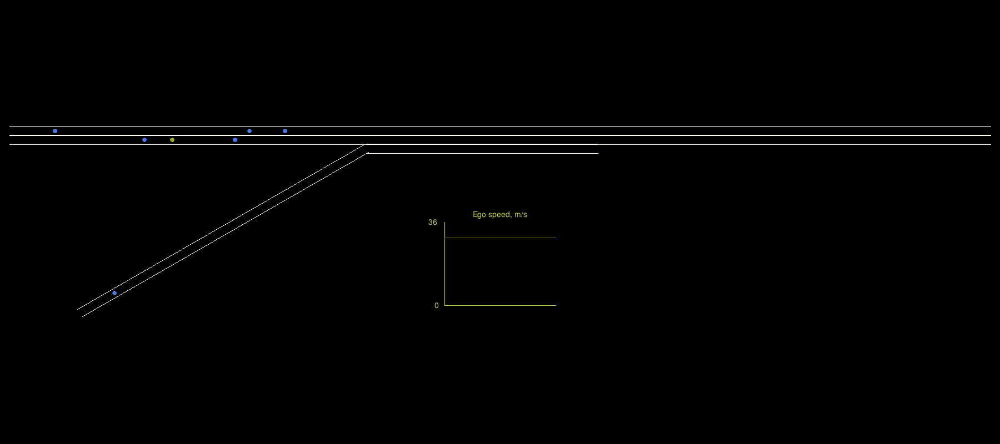
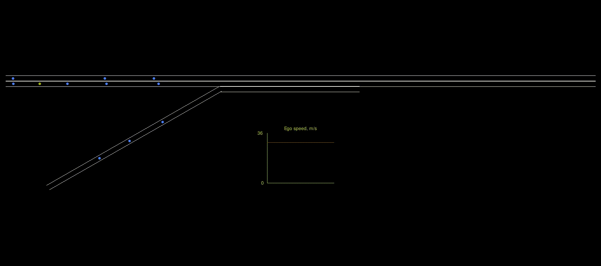
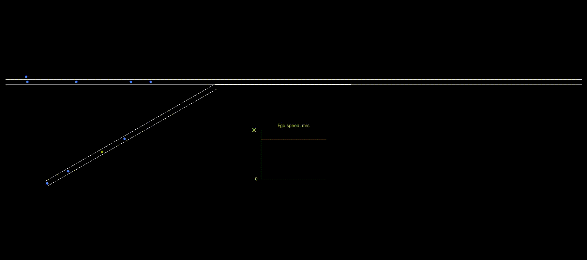
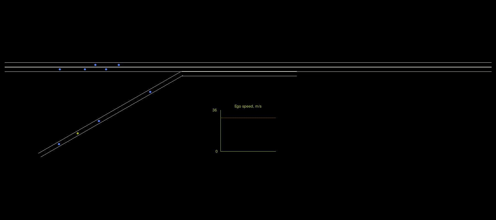
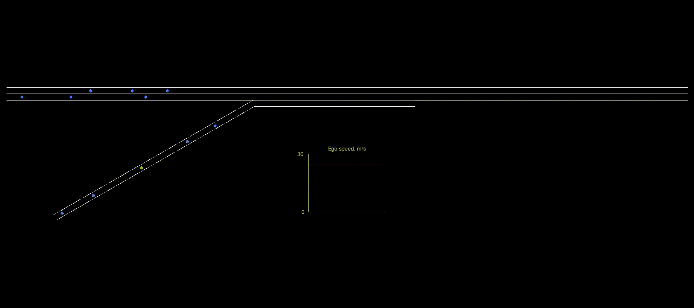

# CDA0 (Armando)
This project is the first in what is expected to be a series of projects of increasing complexity to train AI agents that help solve some problems in Cooperative Driving Automation (CDA).
I used the [Ray/RLlib platform](https://docs.ray.io/en/latest/rllib/index.html), version 2.5.1, for training agents using Reinforcement Learning (RL).

## Repo Summary
This particular repo contains code that represents a simple highway driving scenario and trains a single RL agent to safely drive in that (simulated) environment.
Its primary purpose was to gain experience with the Ray training platform and with RL techniques and issues related to automated driving.
The environment model is built to the Gymnasium standard, which is supported by Ray.
The driving problem is formulated as an episodic problem (there is a definite end), where the agent drives from its starting point on the simulated track until it either reaches the end of the track (success) or drives off-road, crashes into another vehicle or comes to a stop in the roadway (all failures).
The RL agent takes in observations of the world - for this project, they are idealized and readily available - and its neural network (NN) maps those observations into an appropriate set of actions for a given small time step.
The environment model then moves the world model forward by one time step, by calculating the new state of the world and the agent using the programmed dynamics.
It takes in the agent's current actions, determines the new state of the world, and returns a new set of observations that the agent senses.

## Environment Model
The environment represents a 2 km section of two-lane highway with an on-ramp on the right side.
Vehicles on the ramp need to change lanes to merge into the mainline traffic, and thus need to be aware of neighboring vehicles and possibly maneuver around them.
Likewise, vehicles in the mainline traffic may need to adjust speed or lane position to accommodate traffic merging from the ramp.
The roadway has a posted speed limit of 29.1 m/s (65 mph) throughout.
The model allows one trained RL agent and a configurable number of dumb neighbor vehicles.
The neighbor vehicles all run the same dynamics algorithm, which forces it to stay in its assigned lane (except for merging off the ramp) and at a constant speed if possible.
The exception to constant speed is that the neighbors are equippped with a crude Adaptive Cruise Control (ACC) to keep them from rear-ending vehicles in front of them.
The trained agent (the ego vehicle), however, has freedom to change lanes and speed at will throughout the course of an episode.
When the ego vehicle decides to change lanes, it is modeled as a realistically slow process that takes 3 seconds.
Throughout that time, the vehicle is considered to occupy space in both the originating lane and the target lane, since some fraction of it will be over the dividing line; thus, for crash determiation purposes, neither lane has room for another vehicle at that downtrack location.
When an episode begins, the ego vehicle and all neighbors are placed at random locations near the beginning of the track and assigned random initial speeds.
The environment model returns a reward to the agent after each time step, for training purposes.

#### Observation Space
The observation vector contains 56 elements, which are detailed in the [main environment class](simple_highway_with_ramp.py#237).
In short, it includes current and previous actual speed, current and previous desired speed, current and previous lane change command, steps since previous lane change, and distance remaining in the current lane, plus several sensor zones.
There are 9 geographical zones surrounding the ego vehicle's current location, each of which gives it information about what is happening in that small zone.
There are two rows of zones in front of the ego vehicle, and a zone each on its left, right, and rear.
They indicate whether there is drivable pavement there (a lane exists), if the lane is reachable from ego's current location (e.g. not separated by grass), whether it is occupied by another vehicle, and if so, that vehicle's speed and downtrack location.

#### Action Space
The environment accepts two continuous actions in [-1, 1].
- Desired speed, which the environment scales to [0, 36] m/s
- Lane change command, which is interpreted as:
	- [-1, -0.5) -> change lane left
	- [-0.5, 0.5] -> stay in current lane
	- (0.5, 1] -> change lane right

For simplicity, it is assumed that there is a lower-level controller that can handle vehicle steering to make the lane change happen.
The only requirement for this agent is to determine when a lane change is to begin.
Once it issues such a command, the maneuver gets underway and cannot be interrupted; until the lane change maneuver is complete, additional lane change commands are ignored.
For longitudinal motion, the environment places physical limits on both acceleration and jerk, so desired speed commands cannot always be obeyed immediately.

#### Reward
The reward encourages the agent to stay close to the posted speed limit and to limit how much it changes speeds or lanes.

## Training
Training was performed with the SAC algorithm and used the Ray Tune functionality to provide automated assistance in searching for appropriate hyperparameters.
The tuning is captured [in the code here](cda0_tune.py).
Since SAC is pretty tolerant of HP selection, there is not a lot to tune.
However, it is evident that this particular problem's solution was sensitive to the amount and timing of noise added to the commanded actions.
Therefore, noise magnitude and duration were HPs subjected to tuning.
Noise is provided as a Gaussian random sequence that gradually tapers from its initial magnitude to 10% of that magnitude over the chosen number of steps.
Learning rates have also been specified as tunable HPs, but they probably don't need to be.
While the training "success" goal was set a mean reward > 8 for level 5, training results never reached that threshold, probably in part due to a significant amount of noise always present.
However, when a trial was observed to perform reasonably well, in terms of reward plots, the final evaluation was a set of manual runs with the inference program to observe its the agent's actual behavior in several random situations.
Often, the successful agent chooses a trajectory that earns a less-than-stellar reward in order to deal with traffic congestion and avoid all of the failure modes.
The result is a trajectory that is surprisingly appealing, as it tends to resemble what how many human drivers would behave.

## Inference
The [inference program](inference.py) includes a graphical display of the simulation in live operation.
Everything in the simulation is scaled consistently, except the display of lane width, which is greatly exaggerated for easier visibility.
Inference runs an episode at 5x real time just to keep things interesting for the viewer.
The agent vehicle is shown as a yellow dot (sorry, the visuals are not to scale, but the underlying physics model is), and untrained neighbor vehicles are shown as blue dots.

## Building and Running
I have been running in a conda environment, which can be set up using the [requirements.txt](requirements.txt) file provided.
`conda create -f requirements.txt -n <your_env_name>`
However, note that all operations have been performed on a particular Linux laptop with GeForce RTX 3080 laptop GPU, which has driven the installation of particular CUDA-related packages.
Therefore, your mileage may vary, and a somewhat different setup may be needed.

A new training job can be run from scratch (a newly randomized NN structure) with
`python cda0_tune.py <level>`
where <level> is the difficulty level of the environment; if not specified, it will default to 0 (the simplest).
The agent shown in the video clip above is operating at level 5, which includes 6 randomized neighbors, and is the highest level defined.
The levels are described in more detail at the top of the [environment code](simple_highway_with_ramp.py).
Since Ray generates a large amount of log info, and this program contributes some key info to the log as well (all written to stdout), you may prefer to capture all that in a file for future reference.
To capture all the stdout as well as stderr info, for improved debugging, while simultaneously watching it scroll on the terminal window, you can use a command like this:
`python -u cda0_tune.py 5 > >(tee ~/tmp/log) 2> >(tee -a ~/tmp/log) >&2`

#### A note about difficulty levels
At one point, I was playing with the application of curriculum learning, which opened up a whole rabbit hole of interesting research.
Curriculum learning is where multiple levels of difficulty are defined, and you train the agent to just do the simplest tasks first; once it is capable of performing that work consistently, the level can be increased, and so on.
In a round-about way, this also led me to do some Population Based Training (PBT), which is a fascinating way to automate the tuning of HPs for some training algos (I was using PPO at the time), but is not appropriate for SAC.
For several reasons, I found PBT and curriculum learning to be inappropriate for this particular problem, so abandoned them.
But you'll find the code still here, so there are several pieces of code in the repo that are no longer actively in use.

## License & Authorship
This software is published under the [Apache 2.0 open source license](LICENSE), and can be used and distributed according to the terms of that license.
It was written by John Stark.

## More Videos
	

