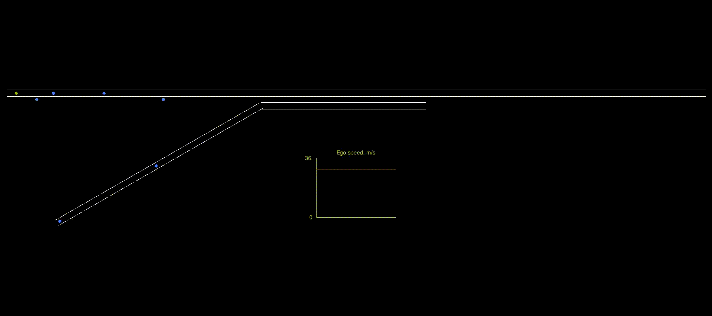

# CDA0
Initial prototype AI agent for cooperative driving automation (CDA)
This project is the first in what is expected to be a series of projects of increasing complexity to train AI agents that help solve some problems in Cooperative Driving Automation (CDA).
We use the [Ray/RLlib platform](https://docs.ray.io/en/latest/rllib/index.html) for training agents using Reinforcement Learning (RL).

## Repo Summary
This particular repo contains code that represents a simple highway driving scenario and trains a single RL agent to safely drive in that (simulated) environment.
Its primary purpose was to gain experience with the Ray training platform and with RL techniques and issues related to automated driving.
The environment model is built to the Gymnasium standard, which is supported by Ray.
The driving problem is formulated as an episodic problem (there is a definite end), where the agent drives from its starting point on the simulated track until it either reaches the end of the track (success) or drives off-road, crashes into another vehicle or comes to a stop in the roadway (all failures).
The RL agent takes in observations of the world - for this project, they are idealized and readily available - and its neural network (NN) maps those observations into an appropriate set of actions for a given small time step.
The environment model then moves the world model forward by one time step, by calculating the new state of the world and the agent using the programmed dynamics.
It takes in the agent's current actions, determines the new state of the world, and returns a new set of observations that the agent senses.

## Environment Model
The environment represents a 2 km section of two-lane highway with an on-ramp on the right side.
Vehicles on the ramp need to change lanes to merge into the mainline traffic, and thus need to be aware of neighboring vehicles and possibly maneuver around them.
Likewise, vehicles in the mainline traffic may need to adjust speed or lane position to accommodate traffic merging from the ramp.
The roadway has a posted speed limit of 29.1 m/s (65 mph) throughout.
The model allows one trained RL agent and a configurable number of dumb neighbor vehicles.
The neighbor vehicles all run the same dynamics algorithm, which forces it to stay in its assigned lane (except for merging off the ramp) and at a constant speed if possible.
The exception to constant speed is that the neighbors are equippped with a crude Adaptive Cruise Control (ACC) to keep them from rear-ending vehicles in front of them.
The trained agent (the ego vehicle), however, has freedom to change lanes and speed at will throughout the course of an episode.
When an episode begins, the ego vehicle and all neighbors are placed at random locations near the beginning of the track and assigned random initial speeds.
The environment model returns a reward to the agent after each time step, for training purposes.

#### Observation Space
The observation vector contains 56 elements, which are detailed in the [main environment class](simple_highway_with_ramp.py#237).
In short, it includes current and previous actual speed, current and previous desired speed, current and previous lane change command, steps since previous lane change, and distance remaining in the current lane, plus several sensor zones.
There are 9 geographical zones surrounding the ego vehicle's current location that give it information about what is happening in that small space.
There are two rows of zones in front of the ego vehicle, and a zone each on its left, right, and rear.
They indicate whether there is drivable pavement there (a lane exists), if the lane is reachable from ego's current location (e.g. not separated by grass), whether it is occupied by another vehicle, and if so, that vehicle's speed and downtrack location.

#### Action Space
The environment accepts two continuous actions in [-1, 1].
- Desired speed, which the environment scales to [0, 36] m/s
- Lane change command, which is interpreted as:
[-1, -0.5) -> change lane left
[-0.5, 0.5) -> stay in current lane
[0.5, 1] -> change lane right

#### Reward
The reward encourages the agent to stay close to the posted speed limit and to limit how much it changes speeds or lanes.

## Training

## Inference
The [inference program](inference.py) includes a graphical display of the simulation in live operation.
Everything in the simulation is scaled consistently, except the display of lane width, which is greatly exaggerated for easier visibility.
Inference runs an episode at 5x real time just to keep things interesting for the viewer.
The agent vehicle is shown as a yellow dot (sorry, the visuals are not to scale, but the underlying physics model is), and untrained neighbor vehicles are shown as blue dots.
